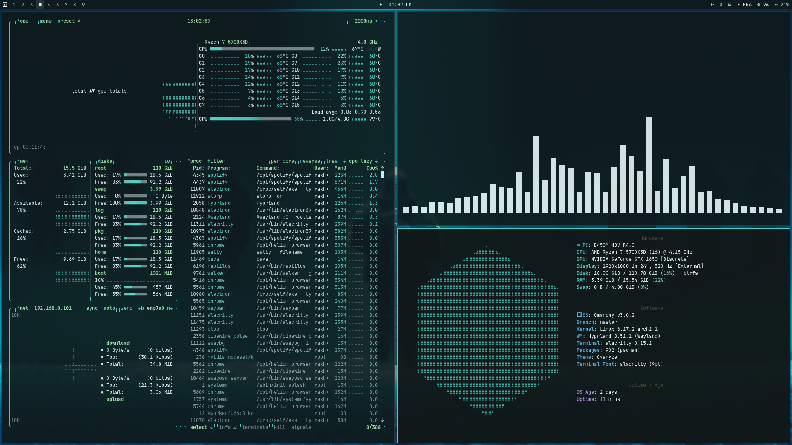

# Cyanyze: Cyan-themed modern design for Omarchy

A minimal and modern cyan-themed design that enhances your desktop environment with clear, readable, and visually appealing colors. Cyanyze features a refreshing cyan palette that provides excellent contrast and readability while maintaining a clean aesthetic. Built specifically for Omarchy, this theme provides consistent styling across your window manager, terminal, applications, and system components.


| Walker launcher preview |
| :--: |
|  |

| Multi-window workspace layout |
| :--: |
|  |

| Other Applications Preview |
| :--: |
|  |

## Installation

```bash
omarchy-theme-install https://github.com/tahfizhabib/omarchy-cyanyze-theme
```

